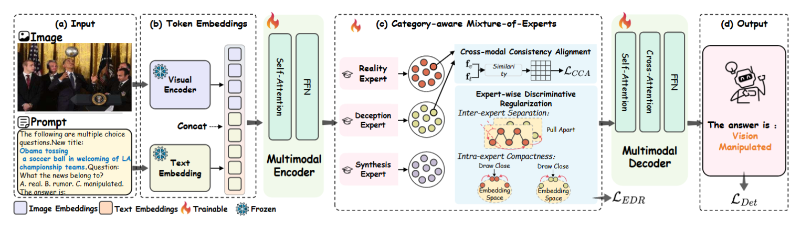

# OmniFake-UMFDet: Towards Unified Multimodal Misinformation Detection in Social Media

<p align="center">
  <a href="https://0112hy.github.io/OmniFakeWeb/"><strong>Project Page</strong></a> |
  <a href="https://arxiv.org/abs/2509.25991"><strong>arXiv</strong></a> |
  <a href="https://huggingface.co/datasets/hy1228/OmniFake98K"><strong>Dataset</strong></a> |
  <a href="#model-weights"><strong>Model Weights</strong></a>
</p>

<p align="center">
  <strong>Official implementation of UMFDet for the OmniFake benchmark.</strong><br>
  A unified framework for detecting human-crafted and AI-synthesized multimodal misinformation.
</p>

<p align="center">
  
</p>

## News

- 2026-07: Code, model configuration files, training script, and evaluation script are released.
- 2026-07: OmniFake98K dataset link is available on Hugging Face.
- 2025-09: Paper released on arXiv.

## Introduction

Multimodal misinformation on social media includes both human-crafted misinformation and AI-synthesized deceptive content. Existing methods often focus on one category only, which limits their practical use when the manipulation type of a real-world post is unknown.

OmniFake-UMFDet provides an open implementation for a unified misinformation detection setting. The benchmark covers real posts, human-crafted rumors, vision manipulation, text manipulation, and mixed manipulation. UMFDet builds on a vision-language model backbone and introduces category-aware expert modeling to improve recognition across heterogeneous misinformation types.

This repository contains the training, evaluation, dataset loading code, and model definition files. Large pretrained weights are intentionally released separately.

## Links

| Resource | Link |
| --- | --- |
| Project page | https://0112hy.github.io/OmniFakeWeb/ |
| arXiv | https://arxiv.org/abs/2509.25991 |
| Dataset | https://huggingface.co/datasets/hy1228/OmniFake98K |
| Code | https://github.com/0112HY/OmniFake-UMFDet |
| Model weights | Coming soon. Place the downloaded weights under `model/`. |

## Repository Structure

```text
OmniFake-UMFDet/
├── assets/
│   └── umfdet_framework.png
├── model/
│   ├── config.json
│   ├── configuration_florence2.py
│   ├── modeling_florence2.py
│   ├── processing_florence2.py
│   ├── preprocessor_config.json
│   ├── tokenizer_config.json
│   ├── tokenizer.json
│   └── vocab.json
├── dataset.py
├── train.py
├── evaluate.py
├── requirements.txt
└── README.md
```

## Installation

Create and activate the environment:

```bash
conda create -n REFORM python=3.10
conda activate REFORM
pip install -r requirements.txt
```

UMFDet uses FlashAttention. If you encounter issues with flash-attn, you can fix it with:

```bash
pip install -U flash-attn --no-build-isolation
```

Alternatively, visit the [flash-attention releases page](https://github.com/Dao-AILab/flash-attention/releases) to find the version compatible with your CUDA, PyTorch, and Python environment.

## Dataset Preparation

Download the OmniFake98K dataset from Hugging Face:

```bash
pip install -U huggingface_hub
huggingface-cli download hy1228/OmniFake98K --repo-type dataset --local-dir data/OmniFake98K
```

The dataset loader expects a CSV file with the following columns:

| Column | Description |
| --- | --- |
| `news_title` | Text/title paired with the image. |
| `img_path` | Path to the image file. Absolute paths are recommended. |
| `label` | Target answer used for training and generation. |
| `label_5` | Five-class label for analysis or filtering. |

The five-class label space is:

```text
real
rumor
vision_manipulation
text_manipulation
mixed_manipulation
```

Before training or evaluation, configure the corresponding dataset CSV path, image path, and model path directly in `train.py` and `evaluate.py`.

## Model Weights

The repository includes the model architecture and processor-related files under `model/`, but does not include large checkpoint weights.

To train UMFDet, you need to download the pretrained [Florence-2 base model](https://huggingface.co/microsoft/Florence-2-base-ft/tree/main). After downloading, place the `pytorch_model.bin` file into the `model/` directory, or set the model path in the scripts to your downloaded checkpoint directory.

The fine-tuned UMFDet checkpoint will be released separately. After downloading the fine-tuned weights, place them under:

```text
model/model.safetensors
```

or set `model_root_path` / `Model_Path` to the checkpoint directory.

## Training

Configure the dataset and model paths in `train.py` before running:

```python
train_csv_path_str = "path/to/train.csv"
model_root_path = "path/to/model_or_checkpoint"

train_dataset = FakeDataset(
    csv_file_path=train_csv_path_str,
    image_directory_path="path/to/train/images"
)

val_datasets = {"fakenews": FakeDataset(
    csv_file_path="path/to/val.csv",
    image_directory_path="path/to/val/images"
)}
```

Then run distributed training:

```bash
python train.py \
  --dataset fakenews \
  --batch-size 24 \
  --epochs 10 \
  --lr 4e-5 \
  --run-name umfdet_omnifake
```

For LoRA training, add:

```bash
--use-lora
```

## Evaluation

Configure the dataset and model paths in `evaluate.py` before running:

```python
Model_Path = "path/to/model_or_checkpoint"

test_dataset = FakeDataset(
    csv_file_path="path/to/test.csv",
    image_directory_path="path/to/test/images"
)
```

Then run:

```bash
python evaluate.py
```

The script reports both five-class and binary real/fake metrics, including accuracy, per-class precision, recall, F1-score, and a confusion matrix.

## Citation

If you find this repository useful for your research, please cite our paper:

```bibtex
@misc{li2025unifiedmultimodalmisinformationdetection,
      title={Towards Unified Multimodal Misinformation Detection in Social Media: A Benchmark Dataset and Baseline},
      author={Haiyang Li and Yaxiong Wang and Shengeng Tang and Lianwei Wu and Lechao Cheng and Zhun Zhong},
      year={2025},
      eprint={2509.25991},
      archivePrefix={arXiv},
      primaryClass={cs.AI},
      url={https://arxiv.org/abs/2509.25991},
}
```

## Acknowledgements

This implementation builds on the Florence-2 vision-language modeling interface and the Hugging Face Transformers ecosystem. We thank the open-source community for providing the tools that make reproducible multimodal research possible.
